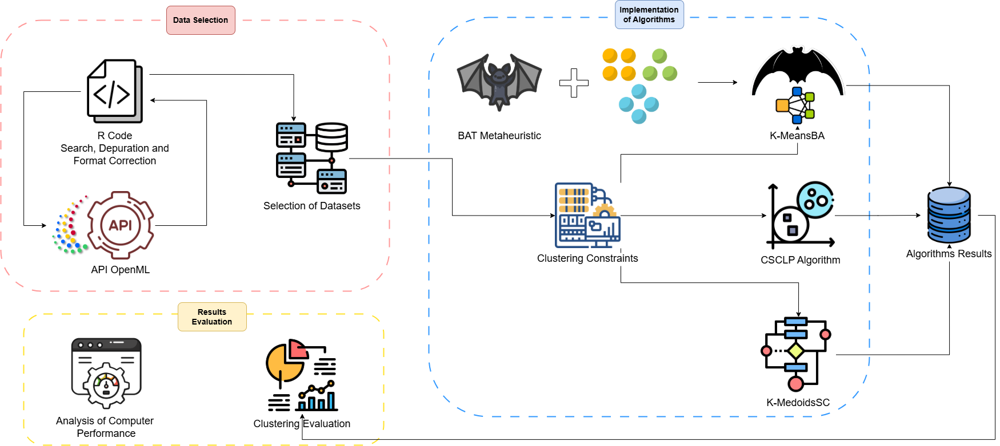

# KMeansBA


*Figure 1: Methodological workflow.*

## Abstract

Clustering with size constraints organizes data while respecting predefined limits on the size of each cluster. This work introduces **K-MeansBA**, a novel extension of K-Means that integrates the Bat Algorithm (BA) to strictly enforce cardinality requirements during the clustering process. Our algorithm optimizes cluster quality—measured by intra-cluster cohesion and inter-cluster separation—while guaranteeing that each cluster contains exactly the designated number of instances. We evaluated the algorithm on **100+ OpenML datasets** using internal metrics (silhouette coefficient) and external metrics (Adjusted Rand Index - ARI, Adjusted Mutual Information - AMI, and Normalized Mutual Information - NMI), alongside direct verification of constraint compliance.  

Key findings include:
- **K-MeansBA reliably enforces size constraints** in all evaluated datasets.
- Competitive clustering quality, particularly in configurations with **fewer clusters**.

## Implemented Algorithms

This repository includes three cardinality-constrained clustering algorithms for comparison:

1. **K-MeansBA**: Our proposed method combining K-Means with the Bat Algorithm for size-constrained optimization.
2. **K-MedoidsSC**: A K-Medoids-based approach with size constraints.
3. **CSCLP**: A linear programming-based clustering algorithm with size constraints.

## Repository Structure

- `KMeansBA.R`: Implementation of **K-MeansBA** and dataset preprocessing logic.
- `OpenML_Datasets.R`: Functions to fetch and filter datasets from OpenML.
- `KmedoidsSC_OpenML.R`: Implementation and evaluation of **K-MedoidsSC**.
- `CSCLP_OpenML.R`: Implementation and evaluation of **CSCLP**.
- `results_KMeansBA.csv`: Results for K-MeansBA (metrics and execution times).
- `results_KmedoidsSC.csv`: Results for K-MedoidsSC.
- `results_CSCLP.csv`: Results for CSCLP.
- `silhouette_results.csv`: Silhouette coefficients for all instances.

## Requirements

Install the required R packages:
```R
install.packages(c(
  "cluster", "proxy", "mlr3oml", "mlr3", "pryr", "dplyr", 
  "aricode", "ggplot2", "corrplot", "clValid", "RColorBrewer", 
  "factoextra", "lpSolve"
))
```

## Dataset Preparation

The `OpenML_Datasets.R` script fetches and preprocesses datasets from OpenML:
```R
source("OpenML_Datasets.R")  # Load datasets into `odatasets_unique`
```

## Basic Usage

### K-MeansBA
```R
dataset <- odatasets_unique[1]$dataset[[1]]   # Select dataset
dataset_name <- odatasets_unique[1]$name     # Dataset name
target_cardinality <- odatasets_unique[1]$class_distribution_vector[[1]]  # Target sizes

# Run clustering
run_clustering(dataset, target_cardinality, dataset_name)  # Results saved to CSV
```

### K-MedoidsSC
```R
result <- run_KmedoidsSC(dataset, target_cardinality, dataset_name)  
```

### CSCLP
```R
result <- run_CSCLP(dataset, target_cardinality, dataset_name)  
```

## Results

Metrics for all algorithms are stored in CSV files:
- **Internal Metrics**: Silhouette coefficient (quality of clusters).
- **External Metrics**: ARI, AMI, NMI (agreement with ground truth labels).
- **Constraint Violations**: Difference between target and actual cluster sizes.

